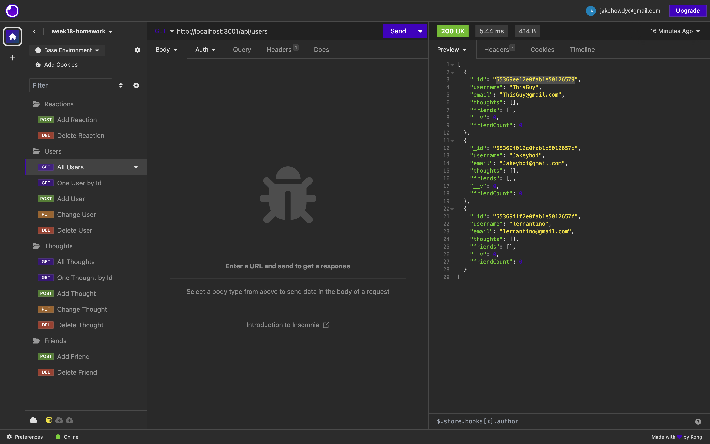

# NoSQL Social Network API

## Description

AS A social media startup
I WANT an API for my social network that uses a NoSQL database
SO THAT my website can handle large amounts of unstructured data

GIVEN a social network API
WHEN I enter the command to invoke the application
THEN my server is started and the Mongoose models are synced to the MongoDB database 

WHEN I open API GET routes in Insomnia for users and thoughts
THEN the data for each of these routes is displayed in a formatted JSON 

WHEN I test API POST, PUT, and DELETE routes in Insomnia
THEN I am able to successfully create, update, and delete users and thoughts in my database 

WHEN I test API POST and DELETE routes in Insomnia
THEN I am able to successfully create and delete reactions to thoughts and add and remove friends to a user’s friend list 

This was achived by writing async functions in the controllers file for each method and then calling them in the api routes folder as required for each route.

## Table of Contents

- [Installation](#installation)

- [Usage](#usage)

- [Questions](#questions)

## Installation

- Step 1: The user will need to have [Node.js](https://nodejs.org/en/download) installed on their PC or use the link provided to install it.

- Step 2: The user will need to install MongoDB and Compass on their computer, which can be acheved by following the provided [link](https://coding-boot-camp.github.io/full-stack/mongodb/how-to-install-mongodb).  In order to see the database the user will 

- Step 3: In order to see/store the database the user will need to set up MongoDB Atlas and can acheive this by following this [link](https://coding-boot-camp.github.io/full-stack/mongodb/how-to-set-up-mongodb-atlas).

- Step 4: Before running the program the user will need to install the npm packages "express & mongoose" associated with the program. This can be acheived by typing 'npm install' into the terminal integrated to the location of the folder holding the program, as they are already populated in package.json.

- Step 5: The user will run the program by following the example provided in the [Usage](#usage) section.

## Usage

Video Example: https://watch.screencastify.com/v/D3LPrQF6X55Oq1xb8qdA

## Questions

Regarding any questions please check out my Github profile [JakeHowdeshell](https://github.com/JakeHowdeshell).

Or send me an [email](mailto:Jakehowdy@gmail.com).